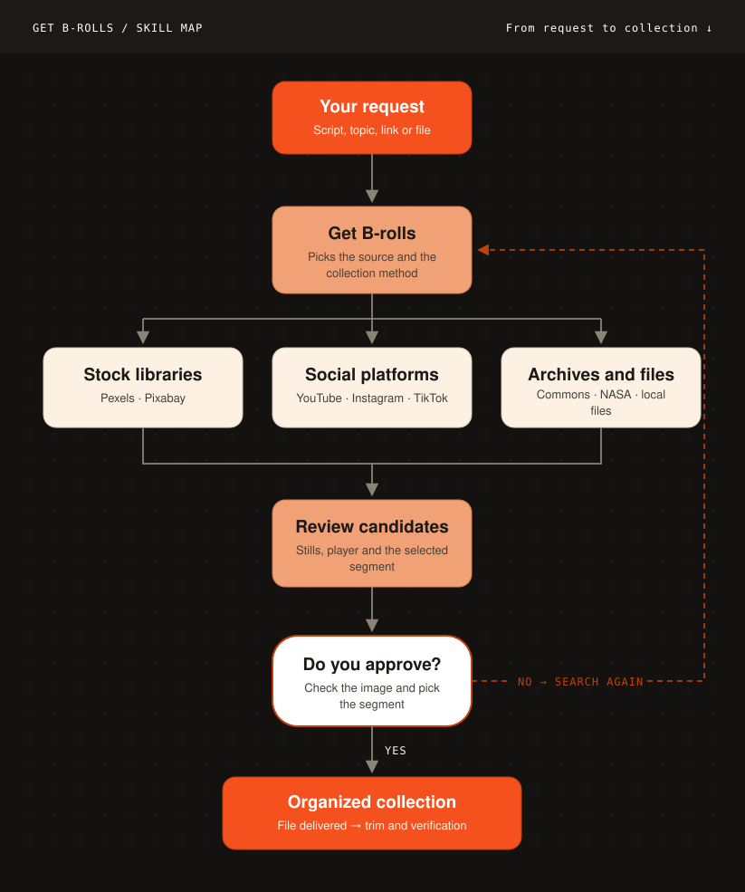
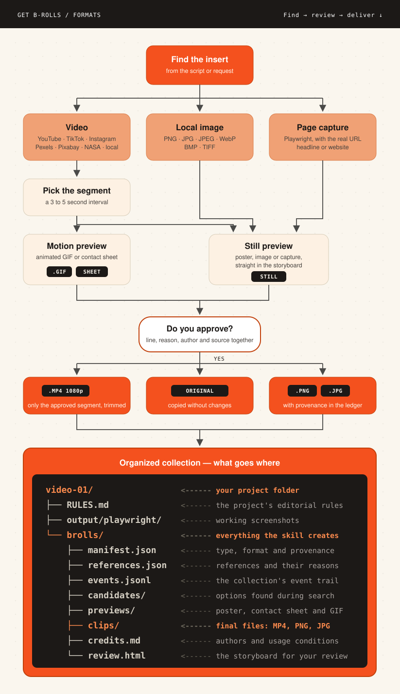

<div align="center">
  <p><a href="README.md">Português</a> · <strong>English</strong></p>
  
  <h1>GET B-ROLLS</h1>
  <p><strong>From an idea to the right shot for your edit.</strong></p>
  <p>Find supporting footage, preview the motion, and review every choice<br>before receiving the final clips with their sources.</p>
  <p><a href="#getting-started">Getting started</a> · <a href="#highlights">Highlights</a> · <a href="#documentation">Documentation</a> · <a href="docs/GUIDE.md#instalação">Full guide</a></p>
  <p align="center">
    
    
    
    
    
    
    
    
    
    
  </p>
</div>

Get B-rolls is a skill for collecting the videos and images that support a line, illustrate an idea, or show the exact person, product, or event mentioned in a script. You describe what you need; the agent researches, prepares previews, and gathers the options into a storyboard for your review.

- **Choose with context.** Each shot can include the supplied narration, selection rationale, time range, creator, and original source.
- **See it before deciding.** GIFs and contact sheets help you evaluate action, framing, and on-screen text.
- **Receive an organized collection.** Final clips are delivered with a record of their origin, review decision, and conditions of use.

The agent looks for the literal source of what you mention: the actual fact, person, product, news item, or screen. Stock-footage libraries are used only when you explicitly ask for stock. You do not need a complete script to request a single insert: simply explain what should appear.

A preview may download working media so you can see the motion. Final delivery requires a human decision and a record of the source's conditions of use. If the time range or context changes, the shot returns to review.

## Updates

- **2.5.0.** Per-project log at `brolls/getbrolls.log` (`GB_LOG_LEVEL`, `GB_LOG_STDERR`): commands, the approval trail, subprocesses and network, with no names, approval statements or URLs. `reject` clears `output`, `verify` checks every clip and unmarks altered ones, and `deliver` skips rejected or failed clips and lists them under `skipped`. Hardened local Storyboard server (only `review.html`, `previews/` and `clips/`, anti-framing headers). An unreadable `~/.getbrolls/RULES.md` now stops the command instead of being ignored.
- **2.4.3.** Single release gate (`scripts/preflight.sh`), one-pass version bump (`scripts/bump_version.py`) and a generated SKILL.md mirror (`scripts/gen_skill_mirror.py`). `GB_CACHE_DIR` now works from `.env`; `GETBROLLS_CACHE_DIR` keeps working. No change to the collection flow.
- **2.4.2.** SKILL.md frontmatter is valid YAML again (quoted `description`; GitHub failed to render the file).
- **2.4.1.** Release workflow fix (FFmpeg on the runner) and the live Instagram rehearsal on record. No CLI behaviour change.
- **2.4.0.** Intake interview and a per-project `BRIEF.md` (`init-brief`/`brief`), chat approval (`approve --all --by NAME --channel chat --statement "..."`), a cross-project library of lessons (`learn`/`library`), source analysis before collecting (`inspect`, `preview --scan`), a `entrega/` folder per beat (`deliver`), a Storyboard that saves decisions inside the project, a ready-to-run next step in `status.summary.do`, `search --shot/--dry-run` and `init-rules --format`.
- **2.3.8.** Paced queue for social batches (`queue`), `instagram_pairs --pace/--max-per-run/--continue-on-error`, yt-dlp sleeps and `Retry-After` handling, readable errors with redacted stderr, interval/NASA/drawtext caching, and a `serve` command for the local Storyboard.
- **2.3.7.** `status --project` command ("where are we?"), self-explanatory CLI with `--version`, `/get-brolls-setup` plugin command, "First B-roll in 5 minutes" quickstart, pinnable tool paths via `GB_*_PATH`, and [AGENTS.md](AGENTS.md) as the repository hub.
- **2.3.6.** Claude Code plugin install — the repository is its own skill marketplace.
- **2.3.5.** First official GitHub release, network hardening (HTTPS/DNS) and pinned dependencies.

Full history in [CHANGELOG.md](CHANGELOG.md).

## How it works

<p align="center"></p>

### What it collects

<p align="center"></p>


## Getting started

### 0. Install the whole stack

The skill only works end to end with **all** of the tools below installed before step 2. Missing one, the collection runs partially and the Storyboard comes out without a preview or without a numbered contact sheet.

| Tool | Used for | Without it |
|---|---|---|
| Python 3.11+ | CLI, ledger, Instagram collector | nothing runs |
| FFmpeg + ffprobe **with libfreetype** (`drawtext`) | poster, numbered contact sheet, GIF, cuts | no preview; without `drawtext` the sheet has no cell number/timecode and the Storyboard shows only the legend |
| Node 22+ with npm/npx | Playwright CLI and yt-dlp EJS runtime | YouTube and Instagram fail |
| curl | Instagram stream pair download | Instagram fails |
| Git | clone and update | manual installation |
| yt-dlp and Playwright CLI | installed by `install.sh`/`install.ps1` in step 2 | YouTube/TikTok and Instagram fail |

macOS (Homebrew):

```sh
brew install python ffmpeg node git curl
```

Windows (winget; Windows PowerShell 5.1 is enough):

```powershell
winget install Python.Python.3.13 Gyan.FFmpeg OpenJS.NodeJS.LTS Git.Git
```

Ubuntu/Debian:

```sh
sudo apt install python3 python3-venv ffmpeg nodejs npm curl git
```

After step 2, `python3 scripts/gb.py doctor` is the gate: empty `summary.missing` and `contact_sheet.labels: true`. If `drawtext` shows up under `summary.optional`, your FFmpeg was built without libfreetype: reinstall it with the command above (on macOS, `brew reinstall ffmpeg`).

### 1. Add the skill to your agent

The official repository is [engenheirodevideo/get-brolls](https://github.com/engenheirodevideo/get-brolls). Clone the source and copy the complete `get-brolls/` folder to **one** of the destinations below:

```sh
git clone https://github.com/engenheirodevideo/get-brolls.git
cd get-brolls
```

| Agent | Personal installation | Inside a project | Invoke with |
|---|---|---|---|
| Codex | `~/.agents/skills/get-brolls/` | `.agents/skills/get-brolls/` | `$get-brolls` |
| Claude Code | `~/.claude/skills/get-brolls/` | `.claude/skills/get-brolls/` | `/get-brolls` |

When copying a development folder, exclude `.venv/`, `.tools/`, caches, projects, and private files. `skills/` and `.claude-plugin/` are Claude Code plugin artifacts and can be omitted when copying to Codex. Install dependencies in the final destination and open a new agent session. [See installation, updates, and compatibility.](docs/GUIDE.md#instalação)

#### Install as a Claude Code plugin

In Claude Code, you can also install the skill as a plugin, without cloning manually:

```text
/plugin marketplace add engenheirodevideo/get-brolls
/plugin install get-brolls@engenheirodevideo
```

Then run `/get-brolls-setup` in the session: the command runs the installer inside the plugin folder — `~/.claude/plugins/cache/engenheirodevideo/get-brolls/<version>/` — and reports the `doctor` verdict. You can also follow step 2 manually in that folder. Repeat the setup after each `/plugin update`. For Codex, the full-folder clone described above remains the way to install.

The skill triggers from the context of your request ("collect b-roll for this video"); the explicit form is `/get-brolls:get-brolls`, and setup is `/get-brolls-setup`. Do not confuse it with generic download skills: this one is the complete pipeline, with human review and a recorded license.

### 2. Prepare the environment

Requirements are the stack from step 0. The [installation guide](docs/GUIDE.md#instalação) covers both platforms in full.

Run the installer for your operating system from the installed skill folder.

macOS:

```sh
bash scripts/install.sh --check
bash scripts/install.sh
python3 scripts/gb.py doctor
```

Windows PowerShell:

```powershell
powershell -ExecutionPolicy Bypass -File scripts/install.ps1 -Check
powershell -ExecutionPolicy Bypass -File scripts/install.ps1
python scripts/gb.py doctor
```

The installer creates local environments and obtains yt-dlp/EJS and Playwright CLI. `--check` only validates prerequisites (Python, FFmpeg/ffprobe, Node, curl, Git) and installs nothing; run it before the full installer to see what is missing. `doctor` checks tool availability once installed; access to each source depends on the URL and, when required, your browser session.

**YouTube works without an API key.** Pexels and Pixabay use their own optional keys, configured in the environment or in the skill's private `.env` file. Available settings are documented in [.env.example](.env.example).

### 3. Make your first request

In Codex:

```text
$get-brolls I need three inserts for a video about the Artemis launch.
Find real footage of the rocket and liftoff, using clips between 3 and 5 seconds.
Prepare the previews and a storyboard for me to review.
Use /path/to/my-video to store the project.
```

In Claude Code, replace the first invocation with `/get-brolls`. Replace the folder with the real path to your project, outside the skill installation. You may also provide a specific URL or a local file.

### First B-roll in 5 minutes

The shortest command-line sequence, using a keyless source (NASA). Replace `/path/to/my-video` with your project and `<ID>` with the identifier returned by the search — keep the quotes, because identifiers may contain spaces.

```sh
python3 scripts/gb.py search --provider nasa --query "Artemis launch" --limit 3 --intent literal --project /path/to/my-video
python3 scripts/gb.py preview --candidate "<ID>" --start 0 --end 4 --project /path/to/my-video
python3 scripts/gb.py review --project /path/to/my-video
python3 scripts/gb.py serve --background --project /path/to/my-video
```

Open [the local storyboard](http://localhost:8767/review.html) at the URL the command returned right away, decide on the shots, and export the JSON — opening it via `file://` can disable local saving, so export before closing the page.

```sh
python3 scripts/gb.py import-review --by "Your name" --project /path/to/my-video
python3 scripts/gb.py serve --stop --project /path/to/my-video
python3 scripts/gb.py permit --candidate "<ID>" --evidence "Real conditions of use for this source" --project /path/to/my-video
python3 scripts/gb.py fetch --candidate "<ID>" --project /path/to/my-video
python3 scripts/gb.py verify --project /path/to/my-video
```

At the end, `verify` answers `"count": 1` and the approved clip is in `/path/to/my-video/brolls/clips/`, with origin, creator, and decision recorded in `brolls/credits.md`. Replacing `nasa` with `commons` follows the same flow.

### Onboarding checklist — chat only

If you have never opened a terminal, this is the whole list. Every step is a conversation with the agent; none of them asks for a command.

1. **Install once.** Ask for `/get-brolls-setup`. It installs everything and answers in one line whether you are ready. Repeat after every `/plugin update`.
2. **Say what you need.** `/get-brolls I need supporting footage for my Reel about X` — and say which folder the project lives in.
3. **Answer the interview.** At most seven questions, one at a time. "Whatever you think" is a valid answer: the agent applies a default and shows you what it assumed. To start there directly, use `/get-brolls-brief`.
4. **Check the brief.** It hands back five lines of what it understood and asks whether that is right. Correct it there.
5. **Look at the shortlist.** Before downloading anything, it lists 5 to 8 candidates with title, creator, and the exact window. Say which ones work.
6. **Approve the previews.** Either in chat ("I approve all", or naming the ones you want), or on the Storyboard: ask for `/get-brolls-review`, it sends you a link, you click Approve / Request change / Reject and then **Save decisions**, and come back to say you saved. Nothing is downloaded without this step.
7. **Say who owns the material.** The agent records the usage conditions from what you tell it. You are the one answering for those conditions; it only records what was said and where each file came from.
8. **Receive.** The cuts land in `entrega/`, one folder per shot, each with an `ORIGEM.md` naming its source.
9. **Lost the thread?** Ask for `/get-brolls-status`: it tells you where things stand and what comes next.

## Commands

In order of use — from first contact to delivery:

**1. Install the environment** (once, in the plugin or clone folder):

```text
/get-brolls-setup   # installs dependencies and runs doctor
```

**2. Invoke the skill** with what you need:

```text
/get-brolls <your request>   # Claude Code — describe the inserts and the project folder
$get-brolls <your request>   # Codex — same thing
/get-brolls-brief            # interviews you and writes the video's BRIEF.md
/get-brolls-review           # builds the Storyboard, sends the link, imports the decisions
/get-brolls-status           # says where the collection stands and what comes next
```

**3. Check the environment** when something misbehaves:

```text
python3 scripts/gb.py doctor   # verifies tools and names what is missing
```

**4. Search and choose** (the agent runs these for you, but they work by hand):

```text
python3 scripts/gb.py search ...    # search candidates in the chosen source
python3 scripts/gb.py preview ...   # build GIF/contact sheet for the range
python3 scripts/gb.py review ...    # assemble the brolls/review.html storyboard
python3 scripts/gb.py serve ...     # serve the storyboard at http://localhost:8767/review.html
```

**4b. Paced social batches** (optional, for several Reels/videos at once):

```text
python3 scripts/gb.py queue --action add|next|mark|status ...   # enqueue, get the next item at the right pace, close it out
```

**5. Decide and receive**:

```text
python3 scripts/gb.py import-review ...   # import your storyboard decisions
python3 scripts/gb.py permit ...          # record the source usage conditions
python3 scripts/gb.py fetch ...           # download the approved final cut
python3 scripts/gb.py verify ...          # verify the delivery in the project
```

**6. Lost?** Ask where the project stands:

```text
python3 scripts/gb.py status --project /path/my-video   # per-stage summary, read-only
```

Every subcommand accepts `help`; full syntax lives in the terminal section.


## Highlights

- **Local storyboard.** `review` generates `brolls/review.html`: a page to switch between a still image and a GIF, see the narration, time range, selection rationale, creator, and source, and approve, request an adjustment, or suggest another source per shot. [Storyboard details.](#storyboard)
- **Six sources covered.** YouTube and TikTok without an API key via yt-dlp/FFmpeg, Instagram through the authorized browser with an included video/audio pair collector, Pexels and Pixabay with their own keys, Wikimedia Commons and NASA without a key, and local file import. [See sources and transports.](#sources)
- **Project state at any moment.** `status --project` summarizes candidates, previews, decisions, permissions, and deliveries, with the suggested next step, without changing the project. [See command-line usage.](#command-line-usage)
- **Paced social batches.** `queue` enqueues Instagram/TikTok/YouTube URLs and only returns the next item once the interval and hourly/daily caps allow it — the CLI never sleeps, it tells you how long to wait. `serve` runs the local Storyboard at `http://localhost:8767/review.html` without a loose `http.server` command.
- **Provenance record.** Every delivered shot carries source, creator, time range, and conditions of use — editorial approval is always yours.
- **Protected network access.** The collector accepts only public HTTPS URLs without credentials, rejects hostnames that resolve to local networks, and does not follow redirects.
- **Native on macOS and Windows.** Dedicated installers for both systems; the Bash YouTube helpers are optional.
- **Installable as a Claude Code plugin.** The repository itself is its own plugin marketplace, with `/get-brolls-setup` configuring the plugin folder and a mirrored skill that resolves paths via `${CLAUDE_PLUGIN_ROOT}`. The clone-as-skill flow remains identical for Codex.

## Storyboard

The `review` command generates `brolls/review.html`: a local page where you can evaluate the collection, move between shots, and send decisions back to the agent.

| In the review | What you can do |
|---|---|
| Selected shot | Switch between a still image and a GIF while preserving the original aspect ratio. |
| Context and origin | Inspect the supplied narration, time range, selection rationale, creator, and source link. |
| Decision per shot | Approve, Request a change (comment required; "find another video" lives inside it), or Reject. |
| Save decisions | Download a JSON file for the agent to import into the project. |
| Print / PDF | Generate a static version with frames, sources, and comments. |

The gallery remains static; animation runs only in the selected shot and respects reduced-motion preferences. An optional screenshot of the speaker provides context and remains static. To evaluate a finished composition using the same insert, set `GB_GIF_SCOPE=full` and provide `--full-preview-file`.

Share the complete **`brolls/` folder** so that its images and GIFs remain accessible. To continue editing or regenerate previews, also preserve the originals and `.getbrolls-sources/`. [Review details.](docs/GUIDE.md#storyboard)

## Sources

| Source | How to find it | How it is obtained |
|---|---|---|
| **YouTube** | Keyword search or URL | yt-dlp + FFmpeg; no API key. |
| **Instagram** | Reel found in the browser | Captures video and audio from the same Reel; the included collector joins both streams. |
| **TikTok** | Complete URL discovered in the browser | yt-dlp + FFmpeg; no API key. |
| **Pexels / Pixabay** | Search their stock APIs | Provider-specific key; HTTPS download. |
| **Wikimedia Commons / NASA** | Search public APIs | HTTPS download; no key. |
| **Local file** | Supplied video, image, or screenshot | Local import with origin and creator when provided. |

Pexels and Pixabay are an optional route: the agent turns to stock libraries only when you explicitly ask for stock. The default is the literal source of what the narration cites.

For Instagram, the agent operates the authorized browser and passes both streams to the collector; the script does not capture the session by itself. The [Instagram guide](docs/GUIDE.md#instagram--navegadorplaywright-dois-streams-e-mp4) covers stream pairing, download, audio, and recovery. Instagram and TikTok depend on URL discovery in the browser; the CLI does not implement global keyword search for those platforms.

The collector accepts only public HTTPS URLs without credentials, rejects hostnames that resolve to local networks, pins downloads to the validated address, and does not follow redirects. Files declared through `output=` must remain inside `--config-output-root`; batch outputs stay in the selected directory, and existing files are never overwritten.

Recorded trials include real acquisition from YouTube, Instagram, TikTok, Pexels, and Pixabay. For Commons and NASA, the evidence covers search and file availability without downloading the complete asset during that trial. See the results and their limitations in [Quality and evidence](docs/QUALITY.md).

## Command-line usage

Run the examples below from the skill folder. Replace `/path/to/my-video` with your project folder and `<ID>` with the identifier returned by the search — keep the quotes, because identifiers may contain spaces.

```sh
python3 scripts/gb.py status --project /path/to/my-video
python3 scripts/gb.py rules --project /path/to/my-video
python3 scripts/gb.py references --project /path/to/my-video
python3 scripts/gb.py search --provider youtube --query "NASA Artemis launch" --limit 3 --intent literal --project /path/to/my-video
python3 scripts/gb.py preview --candidate "<ID>" --start 0 --end 5 --reason "Show the liftoff mentioned in the video" --project /path/to/my-video
python3 scripts/gb.py review --project /path/to/my-video
python3 scripts/gb.py serve --background --project /path/to/my-video
```

Open [the local storyboard](http://localhost:8767/review.html) at the URL the command returned right away, review the shots, and export your decisions — opening it via `file://` can disable local saving, so export before closing the page.

```sh
python3 scripts/gb.py import-review --by "Reviewer's name" --project /path/to/my-video
python3 scripts/gb.py serve --stop --project /path/to/my-video
python3 scripts/gb.py permit --candidate "<ID>" --evidence "Real evidence of the conditions of use" --project /path/to/my-video
python3 scripts/gb.py fetch --candidate "<ID>" --project /path/to/my-video
python3 scripts/gb.py verify --project /path/to/my-video
```

Replace the name and evidence with real data. Repeat `permit` and `fetch` for every approved candidate. `approve` can also record an explicit decision you have already received. `verify` checks file integrity and decoding; the editorial judgment remains yours.

`status` answers where the collection stands at any moment — candidates, previews, decisions, permissions, and deliveries, with the suggested next step — and never changes the project. Flow commands also return a `summary` field with a one-line account of what just happened. [Project state and progress.](docs/GUIDE.md#estado-do-projeto-e-progresso)

<details>
<summary>URLs, local files, and settings</summary>

- Specific URL: `resolve --url REAL_URL --shot insert-01 --project /path/to/my-video`.
- Local file: `resolve --file /path/to/original.mp4 --source-url REAL_URL --creator "Creator" --shot insert-01 --project /path/to/my-video`. Use real metadata; a source without a URL may omit `--source-url`.
- Exact narration: add `--narration` to the preview when a script has been supplied.
- Project rules: `init-rules --project /path/to/my-video` creates an editable [RULES.md](docs/RULES.md) with formats, preferred sources, and blocks.
- Choice memory: `remember` records approved or rejected references; `references` reads the history for that project.
- Images and news: import the file or screenshot with its provenance. See [media types](docs/GUIDE.md#tipos-de-assets-e-formatos) and [browser captures](docs/GUIDE.md#captura-de-notícias-e-páginas-pelo-navegador).
- Default GIF: 360 px, 8 fps, 128 colors, up to 10 seconds and 5 MB. A time range beyond the duration limit is rejected; an oversized result falls back to a still preview with a warning. `GB_PREVIEW_MODE=static` uses a poster and contact sheet.
- `--reference-only` prepares a static reference without obtaining remote media; a poster alone does not prove motion.
- The utilities in `scripts/getbrolls/tools/youtube/` provide YouTube search, frames, clips, and verification by `VIDEO_ID`. Their output must be imported through the CLI to become part of the project's record and review.

Use `python3 scripts/gb.py --help` and `python3 scripts/gb.py preview --help` to inspect arguments. Outside the skill folder, use the absolute path to `scripts/gb.py`.

</details>

When upgrading to 2.3.5, regenerate the Storyboard and export a current review. JSON files based on superseded decisions or missing `reviewEpoch` are rejected. [Migration guide (Portuguese).](docs/GUIDE.md#migração-para-235)

## Limits and privacy

Project files and imported originals remain local. Remote search and acquisition connect to the selected providers. Keep API keys, browser sessions, Instagram configs, and signed URLs in a private environment; that data does not belong in the distributed skill folder.

The storyboard is intended for trusted local projects and does not authenticate reviewers. Share only the material required for review. Conditions of use belong to each source; recording a decision does not automatically verify its license. Responsibility for the conditions of use of the material lies with whoever produces the video; the skill answers for source fidelity and for recording the provenance of every asset.

Final resolution depends on the source: prefer 1080p when available and inspect the actual dimensions. The tool preserves aspect ratio and reports format mismatches. It does not automatically assemble the complete video, perform image search through an API, or deliver isolated audio as a final asset.

Run one command per project at a time. Preserve originals, cache, and event history. If the record is saved but page generation fails, run `review` again. The CLI and installer are native on macOS and Windows; the Bash YouTube helpers are optional and have equivalents in the main CLI workflow. See [compatibility](docs/GUIDE.md#compatibilidade).

## Documentation

| Entry | Purpose |
|---|---|
| [README.md](README.md) | Product overview and first use in Portuguese. |
| **[README.en.md](README.en.md)** | Product overview and first use in English (this file). |
| [AGENTS.md](AGENTS.md) | Index for agents and maintainers: repository map, per-agent installation, and maintenance rules. |
| [docs/GUIDE.md](docs/GUIDE.md) · [SKILL.md](SKILL.md) | Complete operating guide and agent execution instructions. |
| [docs/QUALITY.md](docs/QUALITY.md) | Tests, real-world evidence, and known limitations. |
| [docs/RULES.md](docs/RULES.md) · [.env.example](.env.example) | Editorial rules and configuration options. |
| [docs/SECURITY.md](docs/SECURITY.md) | Handling of private data and vulnerability reporting. |
| `scripts/getbrolls/` | Single core: CLI, providers, Storyboard, Instagram collector, and YouTube utilities. |
| `assets/` | Logo, styles, and scripts used by the generated Storyboard. |
| `agents/` · `schemas/` | Agent presentation and data contract. |
| `tests/` · `.github/workflows/` | Tests and quality automation. |

To maintain the project, start with [CONTRIBUTING](CONTRIBUTING.md) and [AGENTS](AGENTS.md). See [QUALITY](docs/QUALITY.md), [CHANGELOG](CHANGELOG.md), and [SECURITY](docs/SECURITY.md) for evidence, changes, and handling of private data. The cloned repository (or the plugin installation) is the official source of the deliverable.

## Author

Created and maintained by **Bruno Moreira — Engenheiro de Vídeo**.  
Instagram: **[@zbrunomoreira](https://www.instagram.com/zbrunomoreira/)**.

Code is available under the [MIT License](LICENSE). External dependencies retain their own terms, listed in [Third-party notices](THIRD_PARTY_NOTICES.md).
