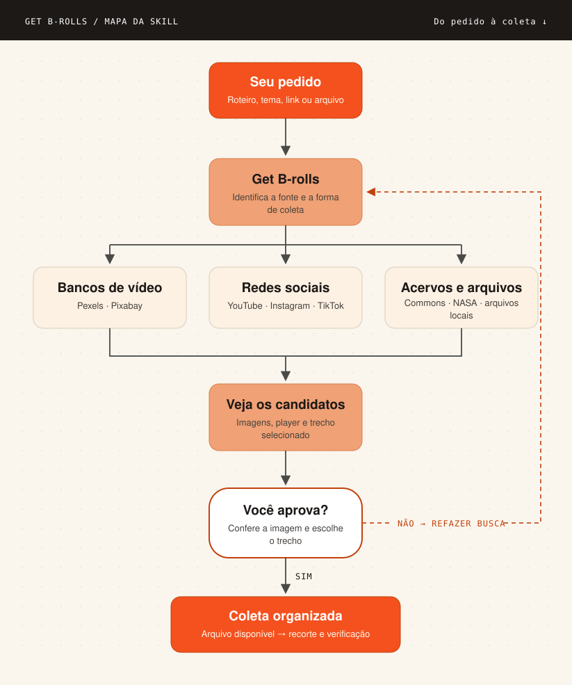
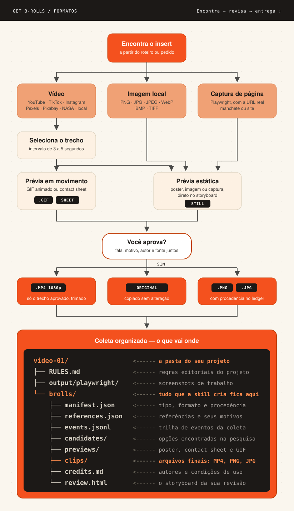

<div align="center">
  <p><strong>Português</strong> · <a href="README.en.md">English</a></p>
  
  <h1>GET B-ROLLS</h1>
  <p><strong>Da ideia ao trecho certo para a sua edição.</strong></p>
  <p>Encontre imagens de apoio, veja o movimento e revise cada escolha<br>antes de receber os cortes finais com suas fontes.</p>
  <p><a href="#comece-aqui">Comece aqui</a> · <a href="#destaques">Destaques</a> · <a href="#documentação">Documentação</a> · <a href="docs/GUIDE.md#instalação">Guia completo</a></p>
  <p align="center">
    
    
    
    
    
    
  </p>
</div>

Get B-rolls é uma skill para coletar os vídeos e imagens que apoiam uma fala, ilustram uma ideia ou mostram exatamente a pessoa, o produto e o acontecimento citados no roteiro. Você descreve o que precisa; o agente pesquisa, prepara as prévias e reúne as escolhas em um storyboard para sua revisão.

- **Escolha com contexto.** Cada trecho pode reunir fala, motivo da escolha, intervalo, autor e fonte original.
- **Veja antes de decidir.** GIFs e sequências de quadros ajudam a avaliar ação, enquadramento e textos sobrepostos.
- **Receba uma coleta organizada.** Os cortes finais ficam junto de um registro de origem, revisão e condições de uso.

O agente procura a fonte literal do que você cita: o fato, a pessoa, o produto, a notícia ou a tela reais. Bancos de vídeo entram somente quando você pedir stock explicitamente. Um único insert funciona sem roteiro completo: basta explicar o que precisa aparecer.

A prévia pode baixar mídia de trabalho para mostrar o movimento. A entrega final depende da decisão humana e do registro das condições de uso da fonte. Se o intervalo ou o contexto mudar, o trecho volta para revisão.

## Atualizações

- **2.3.7 — em revisão.** Comando `status --project` ("onde estamos?"), CLI autoexplicativa com `--version`, comando de plugin `/get-brolls-setup`, quickstart "Primeiro B-roll em 5 minutos", caminhos de ferramentas fixáveis via `GB_*_PATH` e [AGENTS.md](AGENTS.md) como hub do repositório.
- **2.3.6.** Instalação como plugin do Claude Code — o próprio repositório é o marketplace da skill.
- **2.3.5.** Primeira release oficial no GitHub, endurecimento de rede (HTTPS/DNS) e dependências fixadas.

Histórico completo no [CHANGELOG.md](CHANGELOG.md).

## Como funciona

<p align="center"></p>

### O que ela coleta

<p align="center"></p>


## Comece aqui

### 1. Coloque a skill no seu agente

O repositório oficial é [engenheirodevideo/get-brolls](https://github.com/engenheirodevideo/get-brolls). Clone a fonte e copie a pasta completa `get-brolls/` para **um** dos destinos abaixo:

```sh
git clone https://github.com/engenheirodevideo/get-brolls.git
cd get-brolls
```

| Agente | Instalação pessoal | Dentro de um projeto | Como chamar |
|---|---|---|---|
| Codex | `~/.agents/skills/get-brolls/` | `.agents/skills/get-brolls/` | `$get-brolls` |
| Claude Code | `~/.claude/skills/get-brolls/` | `.claude/skills/get-brolls/` | `/get-brolls` |

Ao copiar uma pasta de desenvolvimento, exclua `.venv/`, `.tools/`, caches, projetos e arquivos privados. `skills/` e `.claude-plugin/` são artefatos do plugin do Claude Code e podem ser omitidos ao copiar para o Codex. Instale as dependências no destino final e abra uma nova sessão do agente. [Veja instalação, atualização e compatibilidade.](docs/GUIDE.md#instalação)

#### Instalação como plugin do Claude Code

No Claude Code, você também pode instalar a skill como plugin, sem clonar manualmente:

```text
/plugin marketplace add engenheirodevideo/get-brolls
/plugin install get-brolls@engenheirodevideo
```

Depois, execute `/get-brolls-setup` na sessão: o comando roda o instalador na pasta do plugin — `~/.claude/plugins/cache/engenheirodevideo/get-brolls/<versão>/` — e reporta o veredito do `doctor`. Você também pode seguir o passo 2 manualmente nessa pasta. Repita a configuração após cada `/plugin update`. Para o Codex, o caminho continua sendo o clone da pasta completa descrito acima.

A skill é acionada pelo contexto do pedido ("colete b-roll para este vídeo"); a forma explícita é `/get-brolls:get-brolls` e a configuração é `/get-brolls-setup`. Não confunda com skills genéricas de download: esta é a pipeline completa com revisão humana e registro de licença.

### 2. Prepare o ambiente

Pré-requisitos: Python 3.11+, FFmpeg/ffprobe, Node 22+, npm/npx e curl. Em macOS com Homebrew, comece com `brew install python ffmpeg node`. No Windows, instale as versões oficiais e confirme que os executáveis estão no `PATH`. O [guia de instalação](docs/GUIDE.md#instalação) traz os dois caminhos completos.

Na pasta instalada da skill, use o instalador do seu sistema.

macOS:

```sh
bash scripts/install.sh --check
bash scripts/install.sh
python3 scripts/gb.py doctor
```

Windows PowerShell:

```powershell
powershell -ExecutionPolicy Bypass -File scripts/install.ps1 -Check
powershell -ExecutionPolicy Bypass -File scripts/install.ps1
python scripts/gb.py doctor
```

O instalador cria os ambientes locais e obtém as versões registradas de yt-dlp/EJS e Playwright CLI. `doctor` confere a disponibilidade das ferramentas; o acesso a cada fonte depende da URL e, quando necessário, da sua sessão de navegador.

**YouTube funciona sem API key.** Pexels e Pixabay usam suas próprias chaves opcionais, configuradas no ambiente ou no `.env` privado da skill. As opções estão em [.env.example](.env.example).

### 3. Faça seu primeiro pedido

No Codex:

```text
$get-brolls Preciso de três inserts para um vídeo sobre o lançamento Artemis.
Procure imagens reais do foguete e da decolagem, com trechos de 3 a 5 segundos.
Prepare as prévias e um storyboard para eu revisar.
Use a pasta /caminho/meu-video para guardar o projeto.
```

No Claude Code, troque a primeira chamada por `/get-brolls`. Substitua a pasta pelo caminho real do seu projeto, fora da instalação da skill. Você também pode fornecer uma URL específica ou um arquivo local.

### Primeiro B-roll em 5 minutos

Sequência mínima pelo terminal, com uma fonte sem chave (NASA). Troque `/caminho/meu-video` pelo seu projeto e `<ID>` pelo identificador devolvido na busca — mantenha as aspas, porque os identificadores podem conter espaços.

```sh
python3 scripts/gb.py search --provider nasa --query "Artemis launch" --limit 3 --intent literal --project /caminho/meu-video
python3 scripts/gb.py preview --candidate "<ID>" --start 0 --end 4 --project /caminho/meu-video
python3 scripts/gb.py review --project /caminho/meu-video
python3 -m http.server 8767 --bind 127.0.0.1 --directory /caminho/meu-video/brolls
```

Abra [o storyboard local](http://127.0.0.1:8767/review.html), decida os trechos e exporte o JSON. Em outro terminal:

```sh
python3 scripts/gb.py import-review --file /caminho/revisao.json --by "Seu nome" --project /caminho/meu-video
python3 scripts/gb.py permit --candidate "<ID>" --evidence "Condições reais de uso desta fonte" --project /caminho/meu-video
python3 scripts/gb.py fetch --candidate "<ID>" --project /caminho/meu-video
python3 scripts/gb.py verify --project /caminho/meu-video
```

Ao final, `verify` responde `"count": 1` e o corte aprovado está em `/caminho/meu-video/brolls/clips/`, com origem, autor e decisão em `brolls/credits.md`. Com `commons` no lugar de `nasa`, o fluxo é idêntico.

## Destaques

- **Storyboard local.** `review` gera `brolls/review.html`: uma página para alternar entre imagem estática e GIF, ver fala, intervalo, motivo da escolha, autor e fonte, e aprovar, pedir ajuste ou sugerir outra fonte por trecho. [Detalhes do storyboard.](#storyboard)
- **Seis fontes cobertas.** YouTube e TikTok sem API key via yt-dlp/FFmpeg, Instagram pelo navegador autorizado com coletor de pares vídeo/áudio incluído, Pexels e Pixabay com chave própria, Wikimedia Commons e NASA sem chave, e importação de arquivos locais. [Veja fontes e transportes.](#fontes)
- **Estado do projeto a qualquer momento.** `status --project` resume candidatos, prévias, decisões, permissões e entregas, com o próximo passo sugerido, sem alterar o projeto. [Veja uso pelo terminal.](#usar-pelo-terminal)
- **Registro de origem.** Cada trecho entregue carrega fonte, autor, intervalo e condições de uso — a aprovação editorial é sempre sua.
- **Rede protegida.** O coletor aceita somente URLs públicas HTTPS sem credenciais, rejeita resolução para redes locais e não segue redirecionamentos.
- **Nativo em macOS e Windows.** Instaladores próprios para os dois sistemas; os helpers Bash de YouTube são opcionais.
- **Instalável como plugin do Claude Code.** O próprio repositório é seu marketplace de plugin, com `/get-brolls-setup` configurando a pasta do plugin e uma skill espelhada que resolve caminhos via `${CLAUDE_PLUGIN_ROOT}`. O fluxo clone-como-skill continua idêntico para Codex.

## Storyboard

O comando `review` gera `brolls/review.html`: uma página local para avaliar a coleta, navegar entre os trechos e devolver decisões ao agente.

| Na revisão | O que você faz |
|---|---|
| Quadro selecionado | Alterna entre imagem estática e GIF, mantendo a proporção original. |
| Contexto e origem | Consulta fala fornecida, intervalo, motivo da escolha, autor e link da fonte. |
| Decisão por trecho | Aprova, pede ajuste com comentário ou sugere outra fonte. |
| Exportar revisão | Salva um JSON para o agente importar no projeto. |
| Imprimir / PDF | Gera uma versão estática com quadros, fontes e comentários. |

A galeria permanece estática; a animação acontece no quadro selecionado e respeita a preferência por movimento reduzido. Um print opcional da pessoa serve de contexto e permanece estático. Para avaliar uma composição pronta do mesmo insert, use `GB_GIF_SCOPE=full` com `--full-preview-file`.

Compartilhe a pasta **`brolls/` completa**, para manter as imagens e os GIFs acessíveis. Para continuar editando ou regenerar prévias, preserve também os originais e `.getbrolls-sources/`. [Detalhes da revisão.](docs/GUIDE.md#storyboard)

## Fontes

| Fonte | Como encontrar | Como obter |
|---|---|---|
| **YouTube** | Busca por palavras ou URL | yt-dlp + FFmpeg; sem API key. |
| **Instagram** | Reel encontrado no navegador | Captura de vídeo e áudio do mesmo Reel; coletor incluído une os canais. |
| **TikTok** | URL completa descoberta no navegador | yt-dlp + FFmpeg; sem API key. |
| **Pexels / Pixabay** | Busca nas APIs dos bancos | Chave do respectivo banco; download HTTPS. |
| **Wikimedia Commons / NASA** | Busca nas APIs públicas | Download HTTPS; sem chave. |
| **Arquivo local** | Vídeo, imagem ou captura fornecida | Importação local com origem e autoria, quando informadas. |

Pexels e Pixabay são rota opcional: o agente recorre a bancos somente quando você pede stock explicitamente. O padrão é a fonte literal do que a narração cita.

Para Instagram, o agente opera o navegador autorizado e entrega os dois streams ao coletor; o script não captura a sessão sozinho. O [guia Instagram](docs/GUIDE.md#instagram--navegadorplaywright-dois-streams-e-mp4) cobre seleção dos pares, download, áudio e recuperação. Instagram e TikTok dependem da descoberta da URL no navegador; não há busca global por palavra-chave na CLI.

O coletor aceita somente URLs públicas HTTPS sem credenciais, rejeita resolução para redes locais, fixa o download no endereço validado e não segue redirecionamentos. Arquivos indicados por `output=` permanecem dentro de `--config-output-root`; outputs em lote ficam no diretório escolhido e arquivos existentes não são sobrescritos.

Os ensaios registrados incluem aquisição real de YouTube, Instagram, TikTok, Pexels e Pixabay. Para Commons/NASA, a evidência cobre busca e disponibilidade do arquivo, sem download integral naquele ensaio. Consulte os resultados e seus limites em [Qualidade e evidências](docs/QUALITY.md).

## Usar pelo terminal

Execute os exemplos abaixo na pasta da skill. Troque `/caminho/meu-video` pelo seu projeto e `<ID>` pelo identificador retornado na busca — mantenha as aspas, porque os identificadores podem conter espaços.

```sh
python3 scripts/gb.py status --project /caminho/meu-video
python3 scripts/gb.py rules --project /caminho/meu-video
python3 scripts/gb.py references --project /caminho/meu-video
python3 scripts/gb.py search --provider youtube --query "NASA Artemis launch" --limit 3 --intent literal --project /caminho/meu-video
python3 scripts/gb.py preview --candidate "<ID>" --start 0 --end 5 --reason "Mostrar a decolagem citada no vídeo" --project /caminho/meu-video
python3 scripts/gb.py review --project /caminho/meu-video
python3 -m http.server 8767 --bind 127.0.0.1 --directory /caminho/meu-video/brolls
```

Abra [o storyboard local](http://127.0.0.1:8767/review.html), revise os trechos e exporte as decisões. Depois, em outro terminal na pasta da skill:

```sh
python3 scripts/gb.py import-review --file /caminho/revisao.json --by "Nome de quem revisou" --project /caminho/meu-video
python3 scripts/gb.py permit --candidate "<ID>" --evidence "Evidência real das condições de uso" --project /caminho/meu-video
python3 scripts/gb.py fetch --candidate "<ID>" --project /caminho/meu-video
python3 scripts/gb.py verify --project /caminho/meu-video
```

Substitua o nome, o arquivo exportado e a evidência pelos dados reais. Repita `permit` e `fetch` para cada candidato aprovado. `approve` também pode registrar uma decisão explícita já recebida. `verify` confere integridade e decodificação dos arquivos; a avaliação editorial é sua.

`status` responde onde a coleta está a qualquer momento — candidatos, prévias, decisões, permissões e entregas, com o próximo passo sugerido — e não altera o projeto. Os comandos do fluxo também devolvem um campo `summary` com uma linha dizendo o que acabou de acontecer. [Detalhes do estado e do progresso.](docs/GUIDE.md#estado-do-projeto-e-progresso)

<details>
<summary>URLs, arquivos locais e configurações</summary>

- URL específica: `resolve --url URL_REAL --shot insert-01 --project /caminho/meu-video`.
- Arquivo local: `resolve --file /caminho/original.mp4 --source-url URL_REAL --creator "Autor" --shot insert-01 --project /caminho/meu-video`. Use metadados reais; uma fonte sem URL pode omitir `--source-url`.
- Fala exata: acrescente `--narration` à prévia quando houver roteiro fornecido.
- Regras do projeto: `init-rules --project /caminho/meu-video` cria um [RULES.md](docs/RULES.md) editável com formatos, fontes preferidas e bloqueios.
- Memória de escolhas: `remember` registra referências aprovadas ou rejeitadas; `references` consulta o histórico daquele projeto.
- Imagens e notícias: importe o arquivo ou a captura com sua procedência. Veja [tipos de mídia](docs/GUIDE.md#tipos-de-assets-e-formatos) e [capturas pelo navegador](docs/GUIDE.md#captura-de-notícias-e-páginas-pelo-navegador).
- GIF padrão: 360 px, 8 fps, 128 cores, até 10 segundos e 5 MB. Intervalo acima do limite de duração é recusado; tamanho excessivo gera prévia estática com aviso. `GB_PREVIEW_MODE=static` usa poster e sequência de quadros.
- `--reference-only` prepara uma referência estática sem obter mídia remota; um poster isolado não comprova movimento.
- Os utilitários em `scripts/getbrolls/tools/youtube/` oferecem busca, quadros, cortes e verificação de YouTube por `VIDEO_ID`. Seus resultados precisam ser importados pela CLI para integrar o registro e a revisão do projeto.

Use `python3 scripts/gb.py --help` e `python3 scripts/gb.py preview --help` para consultar os argumentos. Fora da pasta da skill, use o caminho absoluto de `scripts/gb.py`.

</details>

Ao atualizar para 2.3.5, regenere o Storyboard e exporte uma revisão atual. JSONs baseados em decisões anteriores ou sem `reviewEpoch` são recusados. [Veja a migração.](docs/GUIDE.md#migração-para-235)

## Limites e privacidade

Os arquivos de projeto e os originais importados ficam locais. Pesquisa e aquisição remotas se conectam aos provedores escolhidos. Guarde chaves, sessão do navegador, configs Instagram e URLs assinadas em ambiente privado; esses dados não pertencem à pasta distribuída da skill.

O storyboard é destinado a projetos locais confiáveis e não possui autenticação de revisor. Compartilhe apenas o material necessário à revisão. As condições de uso pertencem a cada fonte; o registro de uma decisão não verifica automaticamente sua licença. A responsabilidade pelas condições de uso do material é de quem produz o vídeo; a skill responde pela fidelidade da fonte e pelo registro da origem de cada asset.

A resolução final depende da fonte: prefira 1080p quando disponível e confira as dimensões reais. A ferramenta preserva a proporção e sinaliza incompatibilidades de formato. Ela não monta automaticamente o vídeo completo, não faz busca de imagens via API nem entrega áudio isolado como asset final.

Execute um comando por projeto de cada vez. Preserve originais, cache e histórico de eventos. Se o registro for salvo e a geração da página falhar, execute `review` novamente. A CLI e o instalador são nativos em macOS e Windows; os helpers Bash de YouTube são opcionais e têm equivalentes no fluxo principal da CLI. Veja [compatibilidade](docs/GUIDE.md#compatibilidade).

## Documentação

| Entrada | Para que serve |
|---|---|
| **[README.md](README.md)** | Visão do produto e primeiro uso (este arquivo). |
| [README.en.md](README.en.md) | Product overview and first use in English. |
| [AGENTS.md](AGENTS.md) | Índice para agentes e mantenedores: mapa do repositório, instalação por agente e regras de manutenção. |
| [docs/GUIDE.md](docs/GUIDE.md) · [SKILL.md](SKILL.md) | Manual completo e instruções de execução para o agente. |
| [docs/QUALITY.md](docs/QUALITY.md) | Testes, evidências reais e limites conhecidos. |
| [docs/RULES.md](docs/RULES.md) · [.env.example](.env.example) | Regras editoriais e opções de configuração. |
| [docs/SECURITY.md](docs/SECURITY.md) | Tratamento de dados privados e relato de vulnerabilidades. |
| `scripts/getbrolls/` | Núcleo único: CLI, provedores, Storyboard, coletor Instagram e utilitários YouTube. |
| `assets/` | Logo, estilos e scripts usados pelo Storyboard gerado. |
| `agents/` · `schemas/` | Apresentação no agente e contrato de dados. |
| `tests/` · `.github/workflows/` | Testes e automação de qualidade. |

Para manter o projeto, comece por [CONTRIBUTING](CONTRIBUTING.md) e [AGENTS](AGENTS.md). Consulte [QUALITY](docs/QUALITY.md), [CHANGELOG](CHANGELOG.md) e [SECURITY](docs/SECURITY.md) para evidências, mudanças e tratamento de dados privados.

## Autor

Criado e mantido por **Bruno Moreira — Engenheiro de Vídeo**.  
Instagram: **[@zbrunomoreira](https://www.instagram.com/zbrunomoreira/)**.

Código sob [licença MIT](LICENSE). Dependências externas mantêm suas próprias condições, descritas nos [avisos de terceiros](THIRD_PARTY_NOTICES.md).
